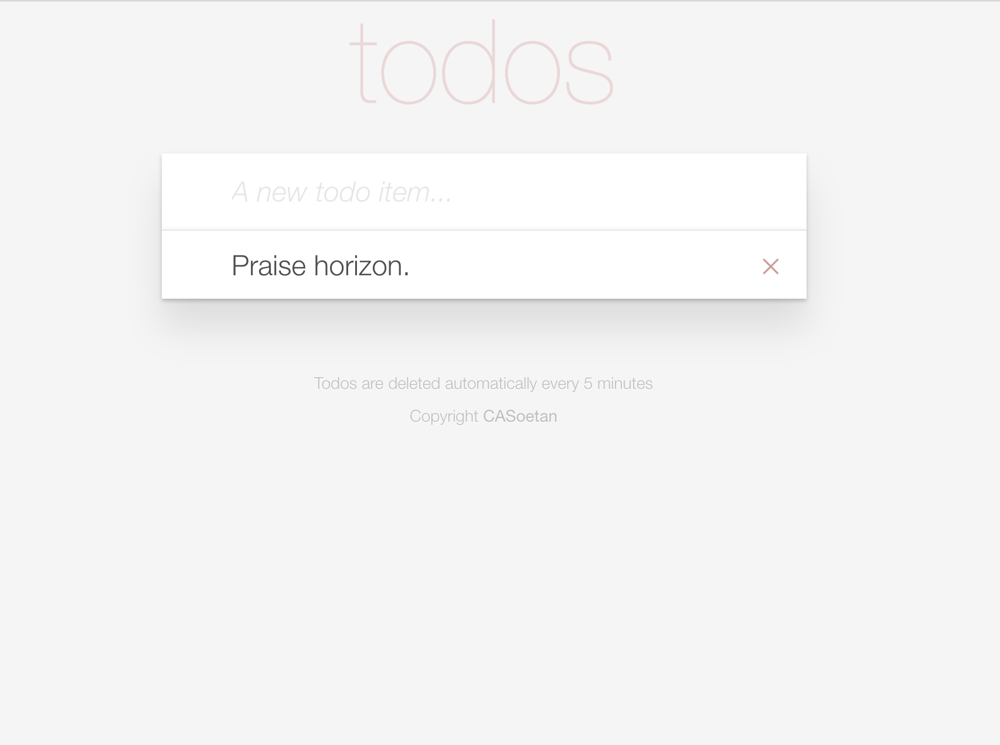

# react-horizon

Start a realtime (live and production ready) web app in seconds.

Updated for horizon 2.0.

PS. More updates coming soon



### Stack

- [facebook/react](https://github.com/facebook/react) - View
- [reactjs/redux](https://github.com/reactjs/redux) - State
- [rethinkdb/horizon](https://github.com/rethinkdb/horizon) - Realtime Database Sync
- [redux-observable/redux-observable](https://github.com/redux-observable/redux-observable) - Async calls with rxjs
- [gaearon/react-hot-loader](https://github.com/gaearon/react-hot-loader) - Hot Reloading
- [webpack/webpack](https://github.com/webpack/webpack) - Builds & Dev-Server

### Installation
``` bash
$ npm install -g horizon
$ git clone --depth=1 https://github.com/casoetan/react-horizon
$ cd react-horizon
$ npm i
$ hz create-cert
$ mv horizon-cert.pem ./source/server
$ mv horizon-key.pem ./source/server
```

### Realtime DB
Using brew?
``` bash
$ brew update
$ brew install rethinkdb
$ brew tap homebrew/services
$ brew services start rethinkdb
```


### Run
``` bash
$ npm start # starts app in dev mode
$ npm run prod # starts server in production mode
$ npm run build # builds source files in .build/
$ node .build/server.bundle.js # starts server (after you built with npm run build)
```

This will start a server listening on ```https://localhost:3000``` for dev (Allow https for localhost).
*You can change the port in* ```config/page.js``` *or by setting the ```PORT``` environment variable*.

### Contributing
Pull Requests are very welcome!

### Thanks
- A big thank you to [flipace/lovli.js](http://github.com/flipace/lovli.js) - Lovli.js for his great boilerplate which guided this development
- Another big thank you to [jayphelps](http://github.com/jayphelps) of [redux-observable/redux-observable](http://github.com/redux-observable/redux-observable) for helping smooth all the rough edges

### License
(MIT)
